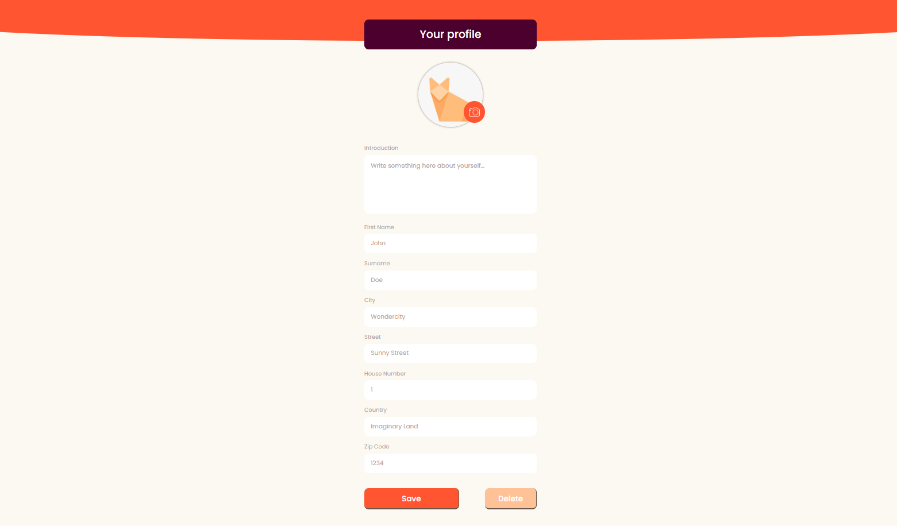

# Profile Editor

Profile Editor was a project during my studies to learn and practice
- working with and existing backend
- using Fetch API to handle forms

Clicking on *Save* button after uploaded a profile picture and entered the profile data will create a new profile image and profile.json file in *backend/data* folder.
Clicking on *Delete* button will delete the profile image and the profile.json file from the folder.
Please note that new profile will overwrite the existing data.

## Usage

1. Clone the project

2. Navigate into *backend* folder
```
cd backend
```

3. Install *dependencies* listed in package.json
```
npm install
```

4. Run *server.js* (in *backend* folder)
```
node server.js
```

## Preview
